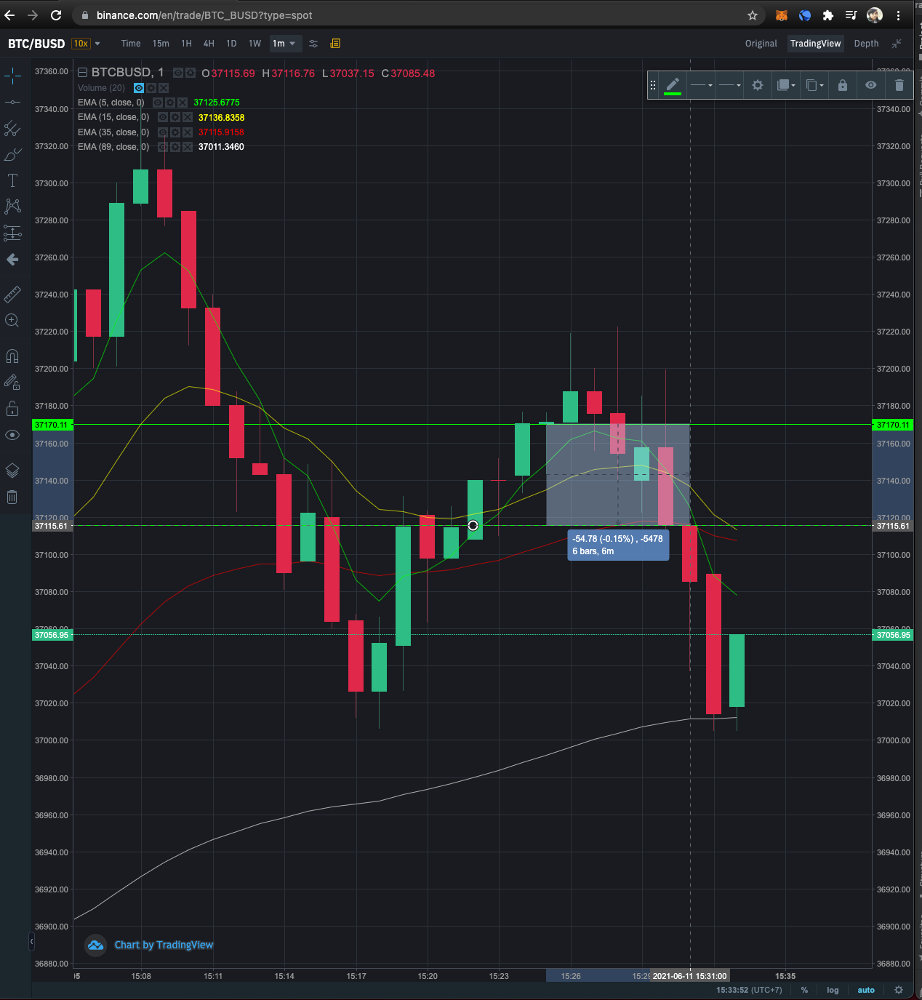
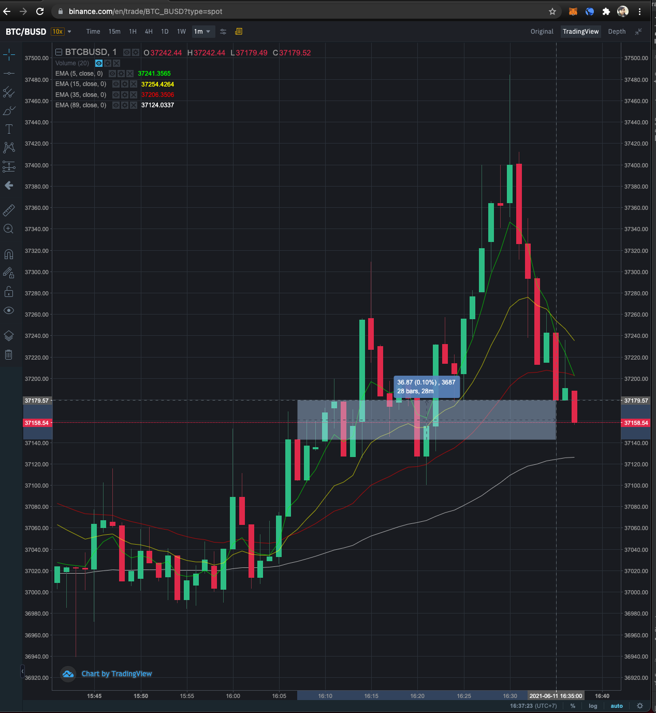

# MagicKiat CryptoBot

[Crypto Trading Bot EP.1](https://magickiat.cc/2021/06/10/crypto-trading-bot-ep-1/)

[Crypto Trading Bot EP.2](https://magickiat.cc/2021/06/10/crypto-trading-bot-ep-2/)


This software is for educational purposes only. USE THE SOFTWARE AT YOUR OWN RISK. THE AUTHORS AND ALL AFFILIATES ASSUME NO RESPONSIBILITY FOR YOUR TRADING RESULTS. Do not risk money which you are afraid to lose. There might be bugs in the code - this software DOES NOT come with ANY warranty.


# How to build
1. You should edit code in `cc.magickiat.crypto.bot.restClient.newOrderTest` 
   search `restClient.newOrderTest` and replace with `restClient.newOrder` BECAUSE IT YOU TO PREVENT YOU TO LOSS MONEY BY CALL REAL TRADE!!!
2. Download project [Java Binance API](https://github.com/binance-exchange/binance-java-api) build project and install to local maven repository with maven command
   ```shell
    mvn install
    ```
3. Build this project with maven command
   ```shell
    mvn package
    ```
4. Copy folder `config` and `target\magicbot.jar` to any folder you want
5. Run bot with command
   ```shell
   java -jar magicbot.jar
   ```

# Config
1. You should config environment variable
   - BINANCE_API_KEY
   - BINANCE_API_SECRET
2. in `config\bot.properties`
   ```
   trade.symbol=<Trade symbol asset pair eg. BTCBUSD>
   trade.timeframe=<Time frame eg. 1m>
   trade.strategy=<Trade stragegy, default should be 'ema-family'>
   trade.strategy.config=<Trade strategy config file path>
   
   trade.strategy.buy=<Buy strategy default should be 'fixed-asset'>
   trade.strategy.buy.fixed-asset.amount=<Fixed cash eg. 10 BUSD>
   trade.strategy.sell=<Sell strategy default should be 'fixed-asset'>
   trade.strategy.sell.fixed-asset.amount=<Fixed cash eg. 10 BUSD>
   ```
3. in `config\strategy-ema-family.properties` is trade strategy config, it up to you and trade strategy owner to config
   ```
   ema.period.first=5
   ema.period.second=15
   ema.period.third=35
   ema.period.fourth=89
   trade.take.profit.percent=0.05
   trade.stop.loss.percent=0.02
   ```

# How default trade strategy work
EMA Family is name of default trade strategy.
It used EMA 4 indicators
- EMA period 5
- EMA period 15
- EMA period 35
- EMA period 89

### When trade strategy buy
All EMA line ordered EMA_5 > EMA_15 > EMA_35 > EMA_89

### When trade strategy sell
When any EMA line not ordered: EMA_5 > EMA_15 > EMA_35 > EMA_89

### Example 1 - graph in tradingview.com


### Example 2 - graph in tradingview.com



# How to add new trade strategy
New class and implement `TradeStrategy`.

See example in `EmaFamilyTradeStrategy`.